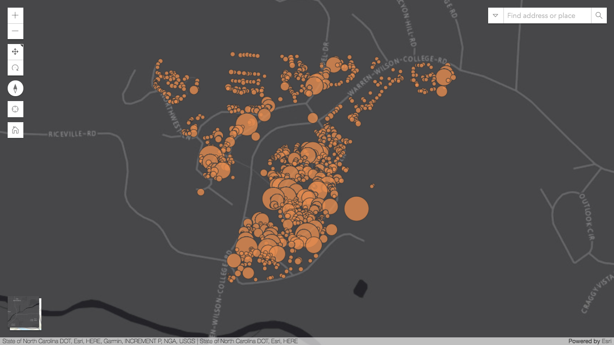

<!-- .slide: data-background="../reveal.js/img/title.png" class="center" -->

# Customizing the ArcGIS API for JavaScript Widgets

### Alan Sangma – [@alansangma](https://twitter.com/alansangma)
### Matt Driscoll – [@driskull](https://twitter.com/driskull)
### JC Franco – [@arfncode](https://twitter.com/arfncode)


---

# Agenda

- About Customizing Widgets
- Prerequisites
- ViewModels
- Views
- Theming
- Q & A


---

# About Customizing Widgets

 What do we mean by customizing?

- Extending an existing widgets view or viewModel
- Recreating a view with or without our widget framework
- Creating a theme for widgets
- Theming a widget


---

# Session Prerequisites

- Accessor (`esri/core/Accessor`)
- Basic knowledge of esri Widgets
  - [Building Your own Widget with ArcGIS API for JavaScript](https://devsummitps17.schedule.esri.com/session-catalog/1469854870) #shamelessplug
- [TypeScript](https://developers.arcgis.com/javascript/latest/guide/typescript-setup/index.html)


---

## Accessor

- JavaScript API Foundation
- Consistent developer experience
- TypeScript support

---

## Accessor - Unified Object Constructor

```js
var view = new MapView({
  container: "viewDiv",
  map: map
});

var symbol = new SimpleMarkerSymbol({
  style: "square",
  color: "blue"
});

var widget = new BasemapToggle({
  view: view,
  nextBasemap: "hybrid"
});
```

---

## Accessor - Defining Properties

```js
var Foo = Accessor.createSubclass({
  properties: {

    // read-only
    foo: { readOnly: true, value: new Foo() },

    // aliased
    bar: { aliasOf: "foo" },

    // autocast
    baz: { type: SomeClass }
  }
});
```

---

## Accessor - Property watching

```js
// watch for changes using a property chain
view.watch("map.basemap.title", handleTitleChange);

// watch for changes to multiple properties
view.watch("stationary, interacting", handleViewPropChange);
```

---

## Want more Accessor deets?

[Building Classes Using Accessor and the ArcGIS API for JavaScript](https://devsummitps17.schedule.esri.com/session-catalog/234004588)


---

# Esri Widgets

`esri/widgets/Widget`: Our new widget framework

- Accessor-based
- Built with TypeScript


---

# Lifecycle

- `constructor`
- `postInitialize`
- `render`
- `destroy`


---

# `render()`

- Entry point for UI updates
- Driven by widget's state
- JSX used to render our UI

```js
render() {
  return <div>{this.title}</div>;
}
```

---

# Node

- Run JS on the desktop
- Synchronous
- Package manager bundled with Node install (npm)
  - [lots of packages available](https://www.npmjs.com/)


---

# TypeScript

- Superset of JavaScript
- Compiled to JavaScript
- Statically type-checked
- Syntactic sugar... sweet!
  - Use ES6 syntax while targeting ES5 environments


---

# TS = type safety

```ts
let view: MapView | SceneView;

// ...

/*
 * TS2322: Type '"not-a-view"' is not assignable
 * to type 'MapView | SceneView'.
 */
view = "not-a-view";
```


---

# Typings!

Help describe what things are:

```ts
type PresenterNames = "Alan" | "Matt" | "JC";

interface Person {
  name: string;
  age: number;
}

interface Presenter extends Person {
  name: PresenterNames;
}
```

---

# Decorators!

- Enhance classes, properties, methods, parameters

```ts
class Foo extends declared(Accessor) {

  // read-only
  @property({ readOnly: true })
  foo = new Foo();

  // aliased
  @property({ aliasOf: "foo" })
  bar;

  // autocast
  @property({ type: SomeClass })
  baz;
}
```

---

# ViewModels & Views

Our widgets are separated into views and viewmodels

---

# ViewModels

(The brain)

- Core logic of widget resides here
- Provides necessary APIs for the view to do it's thing
- No DOM/UI concerns (think business logic)


---

# ViewModels: Why?

- Framework integration
- Reusability
- Separates concerns

---

# ViewModels: Extending

* Add or override behavior

```ts
class Foo extends declared(Bar) {

  // custom logic
  function yell(): void {
    console.log("AHHHH!");
  }

  // overrides
  function barMethod(): string {
    return "I'm foo now";
  }

}
```

---

# Demo: Voice Search

- [annyang](https://github.com/TalAter/annyang)
- [SearchViewModel](https://developers.arcgis.com/javascript/latest/api-reference/esri-widgets-Search-SearchViewModel.html)
- Use mixin approach
  - isolated
  - reusable

[Demo](../demos/voice-search)

---

# Views

(The face)

- `esri/widgets/Widget`
- Uses ViewModel APIs to render the UI
- View-specific logic resides here


---

# Views: Why?

- Separates concerns
- Framework compatibility

---

# Views: Let's customize!

We're going to customize a widget view using:

- `esri/widgets/Widget`
- JavaScript (plain old vanilla js)

---

# Demo: Compass Widget

- [Compass Basic](https://developers.arcgis.com/javascript/latest/sample-code/widgets-compass-2d/index.html)
- [Compass API Ref](https://developers.arcgis.com/javascript/latest/api-reference/esri-widgets-Compass.html)
- [TSX View](https://github.com/Esri/arcgis-js-api/blob/4master/widgets/Compass.tsx)


---

# Steps

Create a custom widget using our `esri/widgets/Widget` framework (Compass).

[Steps: Compass view](https://github.com/jcfranco/dev-summit-2017-customizing-widgets/blob/master/demo-steps/compass.md)

---

# Demo: Search Widget

- [Search Basic](https://developers.arcgis.com/javascript/latest/sample-code/widgets-search-3d/index.html)
- [Search API Ref](https://developers.arcgis.com/javascript/latest/api-reference/esri-widgets-Search.html)
- [SearchViewModel](https://developers.arcgis.com/javascript/latest/api-reference/esri-widgets-Search-SearchViewModel.html)


---

# Steps

Create a custom view **not** using our widget framework (Search Widget).

[Steps: Search view](https://github.com/jcfranco/dev-summit-2017-customizing-widgets/blob/master/demo-steps/search.md)

---

# Theming


---

# Why Theme?
- Branding
- Match the map
- Contrast with the map
- Based on the environment
- User-specific (e.g. bigger buttons)

---


A powerful scripting language for producing CSS.

---


### Why Sass?
- Modular and DRY
- Organized code
- Makes **theming** easy

---


### Compiling


---
# Let&rsquo;s Create a Theme!

### Your Theme
1. Create your theme directory.
  -   `esri/themes/[your-theme-name]/`
1. Create a Sass file in your directory.
  - `main.scss`

<hr>

### Your App

```
  <link rel="stylesheet"
        href="esri/themes/[your-theme-name]/main.css">
```

---
Before writing a bunch of CSS selectors, let&rsquo;s look at the
# Theming Approach.

---

# Theming Approach

Three main areas:
- Color
- Size
- Typography

---
# Theming Approach

Three main files:
- `base/_colorVariables.scss`
- `base/_sizes.scss`
- `base/_type.scss`

---
# Theming Approach

Default:
```
// Inside base/_colorVariables.scss
$text_color : #6e6e6e !default ;
```

<hr>

Your theme:
```
// Inside esri/themes/[your-theme-name]/main.scss
$text_color : #0079c1;
```

Any value assignment overrides the `!default` value.

But wait...there&rsquo;s more!

---
# Theming Approach

Override the four main **color** variables...
```
$text_color            : #d1d1d1;
$background_color      : #242424;
$anchor_color          : #9e9e8e;
$button_text_color     : #adadad;
```
_...then magic!_


<a href="https://developers.arcgis.com/javascript/latest/guide/styling/index.html" target="_blank">Theming Guide</a>

---
# Theming Demo


---

## Suggested Sessions

- [Building Classes Using Accessor and the ArcGIS API for JavaScript](https://devsummitps17.schedule.esri.com/session-catalog/234004588)
- [Using TypeScript with ArcGIS API for Javascript](https://devsummitps17.schedule.esri.com/session-catalog/685861044)
- [Building Your own Widget with ArcGIS API for JavaScript](https://devsummitps17.schedule.esri.com/session-catalog/1469854870)

---

## Additional Resources

- [JavaScript Sessions at DevSummit](https://devsummit.schedule.esri.com/#search/sessions/q:javascript)
- [Styling](https://developers.arcgis.com/javascript/latest/guide/styling/index.html)
- [Implementing Accessor](https://developers.arcgis.com/javascript/latest/guide/implementing-accessor/index.html)
- [Setting up TypeScript](https://developers.arcgis.com/javascript/latest/guide/typescript-setup/index.html)
- [Widget Development](https://developers.arcgis.com/javascript/latest/guide/custom-widget/index.html)
- [Documentation - 4.3](https://developers.arcgis.com/javascript/)

---

# The source code!

## [esriurl.com/widgets2017](https://github.com/jcfranco/dev-summit-2017-customizing-widgets)


---

# Please Take Our Survey!

1. Download the Esri Events app and go to DevSummit
2. Select the session you attended
3. Scroll down to the "Feedback" section
4. Complete Answers, add a Comment, and Select "Submit"

---

# Questions?


---

# Thank you!


---

<!-- .slide: data-background="../reveal.js/img/end.png" -->
