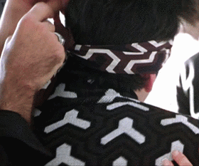

<!-- .slide: data-background="../reveal.js/img/title.png" class="center" -->

# Customizing the ArcGIS API for JavaScript Widgets

### Alan Sangma – [@alansangma](https://twitter.com/alansangma)
### Matt Driscoll – [@driskull](https://twitter.com/driskull)
### JC Franco – [@arfncode](https://twitter.com/arfncode)


---

# Agenda

- About Customizing Widgets
- Prerequisites
- ViewModels
- Views
- Theming
- Tips & Tricks
- Q & A


---

# About Customizing Widgets

 What do we mean by customizing?

- Extending an existing widgets view or viewModel
- Recreating a view with or without our widget framework
- Creating a theme for widgets
- Theming a widget


---

# Session Prerequisites

- Accessor (`esri/core/Accessor`)
- Basic knowledge of esri Widgets
  - [Building Your own Widget with ArcGIS API for JavaScript](https://devsummitps17.schedule.esri.com/session-catalog/1469854870) #shamelessplug


---

## Accessor

- API foundation
 - Properties (getters + setters)
 - Watching for changes
 - Unified object constructor
 - Computed properties, autocasting

---

## Accessor - Properties

```js
// read-only
@property({
  readOnly: true
})
foo = new Foo();

// aliased
@property({
  aliasOf: "bar"
})
foo;

// autocast
@property({
  type: SomeClass
})
foo;
```

---

## Accessor - Watch for changes

```js
// watch for changes using a property chain
view.watch("map.basemap.title", handleTitleChange);

// watch for changes to multiple properties
view.watch("stationary, interacting", handleViewPropChange);
```

---

## Accessor - Unified Object Constructor

```js
var map = new Map({
  basemap: new Basemap({
    baseLayers: new Collection([
      new ArcGISTiledLayer(url)
    ])
  })
});
```

---

## Want more Accessor deets?

[Building Classes Using Accessor and the ArcGIS API for JavaScript](https://devsummitps17.schedule.esri.com/session-catalog/234004588)


---

# Esri Widgets

`esri/widgets/Widget`: Our new widget framework

- Accessor-based
- Built with TypeScript


---

# Lifecycle

- `constructor`
- `postInitialize`
- `render`
- `destroy`


---

# `render()`

- Entry point for UI updates
- Driven by widget's state
- JSX used to render our UI

```js
render() {
  return <div>Hello world!</div>;
}
```

---

# Esri Widget Prerequisites

- [Node.js](https://nodejs.org/)
- [npm](https://www.npmjs.com/)
- [TypeScript](https://developers.arcgis.com/javascript/latest/guide/typescript-setup/index.html)
- [ArcGIS typings](https://developers.arcgis.com/javascript/latest/guide/typescript-setup/index.html)
- [Dojo typings](https://github.com/dojo/typings/wiki/How-To-Use)

---

# Node

- Run JS on the desktop
- Synchronous
- npm bundled with Node install
- [lots of packages available](https://www.npmjs.com/)


---

# TypeScript

- Superset of JavaScript
- Compiled to JavaScript
- Statically type-checked
- Syntactic sugar... sweet!
  - Use ES6 syntax while targeting ES5 environments


---

# TS = type safety

```ts
let view: MapView | SceneView;

// ...

/*
 * TS2322: Type '"not-a-view"' is not assignable
 * to type 'MapView | SceneView'.
 */
view = "not-a-view";
```


---

# Typings!

Help describe what things are:

```ts
type PresenterNames = "Alan" | "Matt" | "JC";

interface Person {
  name: string;
  age: number;
}

interface Presenter extends Person {
  name: PresenterNames;
}
```

---

# Decorators!

- ECMAScript proposal
- Enhance classes, properties, methods, parameters
- A few key decorators
  - `@subclass`
  - `@property`
  - `@property`

---

# ViewModels & Views

You'll notice our widgets have ViewModels.

---

# ViewModels

(The brain)

- Core logic of widget resides here
- Provides necessary APIs for the view to do it's thing
- No DOM/UI concerns (think business logic)
- Accessor classes


---

# ViewModels: Why?

- Framework integration
- Reusability
- Separates concerns

---

# ViewModels: Extending

* Add or override behavior

```ts
class Foo extends declared(Bar) {

  // custom logic
  function yell(): void {
    console.log("AHHHH!");
  }

  // overrides
  function barMethod(): string {
    return "I'm foo now";
  }

}
```

---

# ViewModels: Extending via Mixins

* Isolated pieces of logic
* Reusable
* Mix in to enhance classes

```ts
interface Foo extends

class Foo extends declared(Bar, Mixin) {
   // nothing to see here, mixed in! :)
}
```

[Demo](./demos/voice-input)

---

# Views

(The face)

- `esri/widgets/Widget`
- Uses ViewModel APIs to render the UI
- View-specific logic resides here



---

# ViewModels & Views: Why?

- Separates concerns
- Framework compatibility

---

# Views: Let's customize!

We're going to customize a widget view using:

- `esri/widgets/Widget`
- JavaScript (plain old vanilla js)

---

# Demo: Compass Widget


- [Compass API Ref](https://developers.arcgis.com/javascript/latest/api-reference/esri-widgets-Compass.html)
- [TSX View](https://github.com/Esri/arcgis-js-api/blob/4master/widgets/Compass.tsx)

---

# Demo steps

Create a custom widget using our `esri/widgets/Widget` framework (Compass).

[Demo steps: Compass view](https://github.com/jcfranco/dev-summit-2017-customizing-widgets/blob/master/demo-steps/compass.md)

---

# Demo: Search Widget

- [Search API Ref](https://developers.arcgis.com/javascript/latest/api-reference/esri-widgets-Search.html)
- [SearchViewModel](https://developers.arcgis.com/javascript/latest/api-reference/esri-widgets-Search-SearchViewModel.html)

---

# Demo steps

Create a custom view **not** using our widget framework (Search Widget).

[Demo steps: Search view](https://github.com/jcfranco/dev-summit-2017-customizing-widgets/blob/master/demo-steps/search.md)

---

# Theming

- Why
- What
  - BEM
- How
  - SASS
    - Variables
    - Mixins
    - etc
- Modify existing theme
- Create custom theme using SASS


---

# Tips & Tricks

- compact CSS build
- Automation (autoprefixer)

---

## Additional Resources

- [JavaScript Sessions at DevSummit](https://devsummit.schedule.esri.com/#search/sessions/q:javascript)
- [Documentation - 4.0 beta](https://developers.arcgis.com/javascript/beta/)

---

# Use the source luke

[GitHub Code](https://github.com/jcfranco/dev-summit-2017-customizing-widgets)

github.com/jcfranco/dev-summit-2017-customizing-widgets

todo: shorten url once URL is finalized. (moved to esri account)

---

# Please Take Our Survey!

1. Download the Esri Events app and go to DevSummit
2. Select the session you attended
3. Scroll down to the "Feedback" section
4. Complete Answers, add a Comment, and Select "Submit"


---

# Questions?

---


---

<!-- .slide: data-background="../reveal.js/img/end.png" -->
